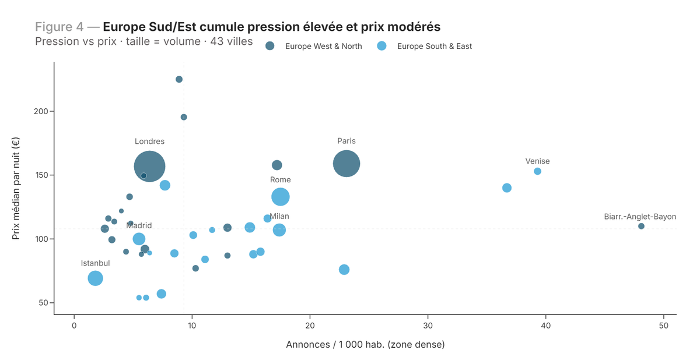

# PBNB — Cartographier 75 marchés Airbnb pour éclairer la régulation touristique


[](https://vincentroue-portfolio.netlify.app/rapports/airbnb-synthese)

> Analyse comparative des marchés de location courte durée sur **75 villes, 30 pays, 4 continents**
> (données Inside Airbnb juin 2025). Trois niveaux géographiques emboîtés — **monde → Europe → France/IRIS** —
> pour situer la pression touristique, la professionnalisation des hôtes et les écarts de prix, avec un
> angle régulation utile aux collectivités.



🔗 **[Lire la synthèse →](https://vincentroue-portfolio.netlify.app/rapports/airbnb-synthese)** · 📄 [Rapport monde](https://vincentroue-portfolio.netlify.app/rapports/airbnb-rapport-monde) · 📊 [Dashboard monde](https://vincentroue-portfolio.netlify.app/rapports/dash_pbnb/dash-monde) · 🇫🇷 [Rapport France](https://vincentroue-portfolio.netlify.app/rapports/airbnb-rapport-france)

---

## Résultats-clés

| Indicateur | Valeur | Lecture |
|---|---|---|
| Villes analysées | **75** (30 pays) | Londres, Paris, Rio, Rome, Buenos Aires en tête des volumes |
| Annonces nettoyées | **816 000** | sur ~1,06 M brutes, après filtres qualité F1–F5 |
| Fracture tarifaire | **× 3,9** | Amsterdam (223 €) vs Budapest (57 €) sur le prix médian nuitée |
| Marché le plus dense | **Londres 61 626 annonces** | devant Paris (51 890) — capitales sous tension |
| Professionnalisation | **63 %** d'hôtes mono-bien | mais le top 10 % capte ~40-47 % de l'offre (Londres Gini 0,45) |
| Indicateurs harmonisés | **62** | sur 10 thèmes (volumes, pression, prix, pro, activité, régulation) |

*Derrière la promesse d'une « économie de partage », les grands marchés révèlent une offre concentrée et professionnalisée : la fracture de prix entre villes (× 3,9) double celle de la concentration entre hôtes.*

---

## Ce que démontre ce projet

- **ETL multi-source à l'échelle** — consolidation de ~1 M d'annonces brutes (Inside Airbnb) en Parquet, enrichies INSEE IRIS et Eurostat, via pipeline Python/DuckDB reproductible.
- **Analyse comparative rigoureuse** — 62 indicateurs harmonisés sur 75 villes, ACP + clustering Ward (Europe 36 marchés), arbre CART, matrices de corrélation mixtes (Dython).
- **Restitution interactive** — site Quarto multi-documents (rapports insight-first, notebooks EDA, dashboards Observable/MapLibre), cartes choroplèthes IRIS pour Paris/Lyon/Bordeaux/Pays Basque.

---

## Livrables

| Livrable | Périmètre | Lien |
|---|---|---|
| Synthèse | porte d’entrée — chiffres clés et cartographie | [→](https://vincentroue-portfolio.netlify.app/rapports/airbnb-synthese) |
| Rapport monde | 75 villes, benchmark continental | [→](https://vincentroue-portfolio.netlify.app/rapports/airbnb-rapport-monde) |
| Rapport France | Paris/Lyon/Bordeaux/Pays basque, échelle IRIS | [→](https://vincentroue-portfolio.netlify.app/rapports/airbnb-rapport-france) |
| Dashboard monde | MapLibre + scatter dynamique 75 villes | [→](https://vincentroue-portfolio.netlify.app/rapports/dash_pbnb/dash-monde) |
| Dashboard France | choroplèthe IRIS, 4 villes | [→](https://vincentroue-portfolio.netlify.app/rapports/dash_pbnb/dash-france) |
| Notebook EDA | distributions, corrélations, structure du panel | [→](https://vincentroue-portfolio.netlify.app/rapports/airbnb-eda) |
| ACP et classification | typologie des marchés | [→](https://vincentroue-portfolio.netlify.app/rapports/airbnb-acp) |
| Annexe méthodologique | pipeline ETL, nettoyage, indicateurs | [→](https://vincentroue-portfolio.netlify.app/rapports/airbnb-methode) |
| Carte interactive | 20 villes européennes, Leaflet | [→](https://vincentroue-portfolio.netlify.app/rapports/airbnb-carte) |

---

## Stack & méthode

**Stack** : Python (pandas, geopandas, DuckDB, scikit-learn) · R (tidyverse, sf, FactoMineR, reactable, leaflet) · Quarto (site multi-docs, OJS/MapLibre, reticulate) · Inside Airbnb + INSEE IRIS + Eurostat.

**Méthode** : ETL consolidation (gz → Parquet, filtres F1–F5, ~70 % rétention) → calcul de 62 KPI harmonisés (volumes, prix, concentration Gini, professionnalisation taxonomie Adamiak) → analyse 3 niveaux (monde / Europe ACP-clustering / France IRIS) → restitution Quarto insight-first + dashboards interactifs.

<details>
<summary>Structure du repo & sources</summary>

```
pbnb-airbnb-log-jrr-jpy/
├── scripts/         # sp07-sp10 : consolidation, KPI, hosts, France multi-niveaux
├── reports/         # site Quarto : rpt-pbnb-*.qmd (rapports, synthèses, EDA, dashboards)
│   ├── helpers/     # ddict-airbnb.json (57 indic), helpers JS/CSS dashboard
│   └── config/      # theme-pbnb-v2.scss
├── data/
│   ├── interim/     # kpi_global_by_city_2506.csv (75×62), dbhosts (412K hôtes)
│   └── external/    # city-reference (pop, housing, FX)
└── gdmeth-indic-airbnb-260109.md   # méthodo : 5 hypothèses, 15 questions évaluatives
```

**Sources** : [Inside Airbnb](https://insideairbnb.com/get-the-data/) (juin 2025, 75 villes) · INSEE IRIS (population, logement) · Eurostat · référentiel villes consolidé.
</details>

<details>
<summary>Reproduire localement</summary>

```bash
# Pipeline ETL (Python)
python scripts/sp07-consolidation.py && python scripts/sp08-kpi.py

# Rendu du site (Quarto + R)
cd reports && quarto render

# Les rendus publies le sont depuis le portfolio (publish-manifest.csv)
```

⚠️ **Dépendance externe** — les chunks R chargent une bibliothèque de helpers partagée
(`mutils/jrr/jcn-all.R` : thèmes graphiques, formats FR, tables, cartes, logging) qui vit dans un
dépôt séparé et n'est pas incluse ici. Les `source()` pointent encore un chemin absolu local.
En l'état, le pipeline Python (`scripts/`) tourne seul, mais **le rendu des rapports R n'est pas
reproductible hors de mon poste**. Portage en cours.
</details>

---

*Projet personnel — Vincent Roue · [Portfolio](https://vincentroue-portfolio.netlify.app) · [GitHub](https://github.com/vincentroue)*
